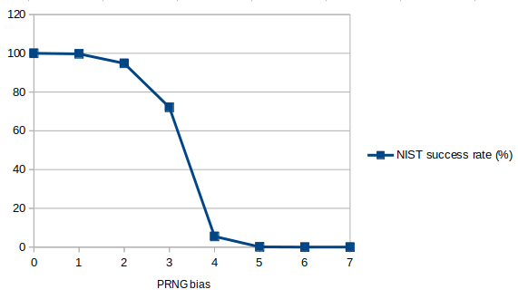

# FIPS 140-2 test for biased PRNG

_How much bias is needed on a good PRNG to fail FIPS 140-2 randomness test?_

---

## Introduction

I would like to know how much bias is needed on a good PRNG to fail FIPS 140-2 randomness test.
We take as reference the system PRNG `/dev/random` and we introduce a bias on it.

Then we run the NIST test suite on the biased PRNG and we measure the success rate.

## How to use

Tested on Ubuntu 22.04.4 LTS.

```bash
$ sudo apt-get install rng-tools5
$ cargo build --release
$ target/release/biased_prng_rs | rngtest -c 1000
```

## Results

| Bias (%) | NIST success rate (%) |
|----------|-----------------------|
| 0        | 100                   |
| 1        | 99.7                  |
| 2        | 94.8                  |
| 3        | 72.1                  |
| 4        | 5.5                   |
| 5        | 0.1                   |
| 6        | 0.0                   |
| 7        | 0.0                   |

(0% bias means 0 and 1 will be generated with the same probability, 100% bias means only 0 will be generated)

